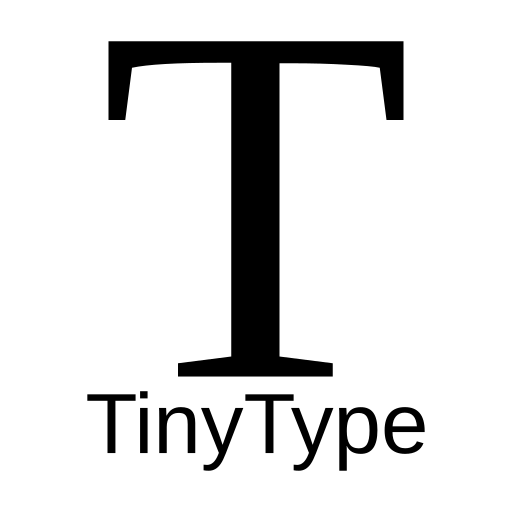
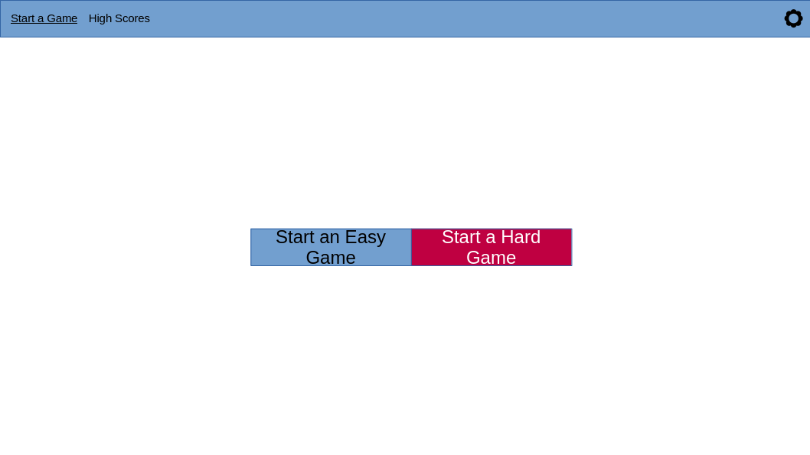
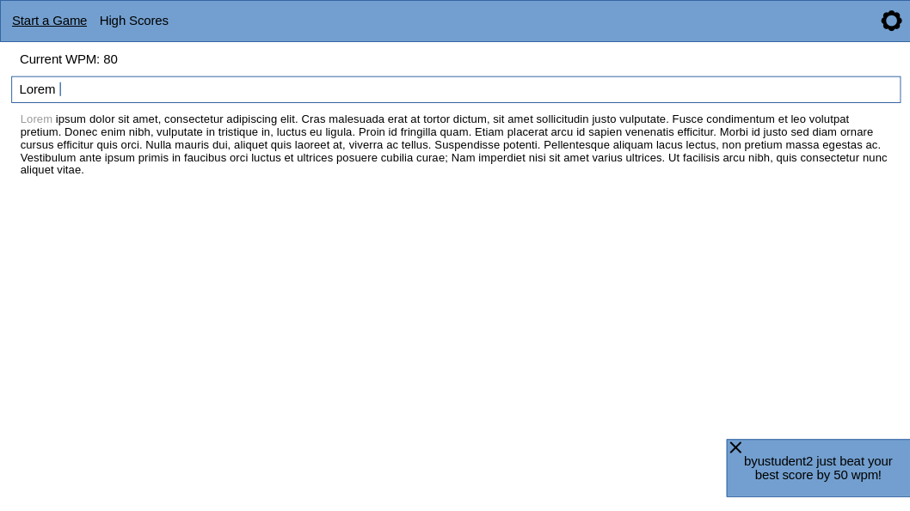
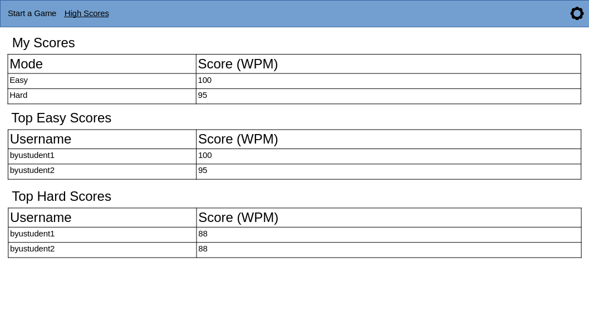

# TinyType

## Access the Project
[https://startup.cs260fullstack.click](https://startup.cs260fullstack.click)

## Course Notes
See notes [here](./notes.md).

## Specification Deliverable

### Elevator Pitch

So you're a computer scientist are you? You think you're good at typing? Well, I'll share a secret with you; you aren't. But you can try your hand at TinyType! TinyType is a word-per-minute-measuring typing challenge that comes in two varieties: easy and hard. It sources its typing samples from Wikipedia! Type them as fast as you can without making mistakes. Compete against global users and see if you are really as good at typing as you think.

### Design

### Key Features

* Users can and are required to create an account.
* Users can play easy or hard typing word-per-minute-measuring typing challenges, with typing samples sourced from Wikipedia.
* WPM is updated live in-browser as typing is done. Text is grayed out in the source text as it is typed.
* "Encouraging" messages are shown as other users submit high scores.
* User and global high-scores are visible on their own page.

### Technology Usage

Required technologies will be used in the following ways:

* HTML - HTML will provide the structure for the webpage, including the nav bar, tables, inputs, etc.
* CSS - CSS will provide a clean look and feel and enable proper layout.
* JavaScript - JavaScript will provide the client-side functionality including the live WPM counter, challenge text graying-out, and showing the motivational messages.
* React - Once rewritten in React, it will provide the required JavaScript interactivity and reuse, including the typing component (displays WPM, manages challenge formatting and text box state, etc.), the motivational message component, and the high score table component. It will also provide routing.
* Service - A backend service with endpoints for the following functionalities:
  * login/logout - Logs in/out the users.
  * newGame - Starts a new game and returns the typing challenge. **NOTE** This will call the Wikipedia API to satisfy the external API requirement.
  * completeGame - Completes a game and reports the high score.
  * scores - Gets both user high scores and global high scores.
* DB/Login - Stores registered users and high scores for users.
* WebSocket - Pushes "motivational messages" to users currently playing as other users submit high scores.

## HTML Deliverable
- [x] **HTML pages** - 5 pages created including: login (main page), account creation, main game, high scores, about.
- [x] **HTML elements** - HTML elements are used appropriately.
- [x] **Links** - The nav menu links between pages. Some external links are included (footer, about pages).
- [x] **Text** - The about page contains two paragraphs text. Text is also scattered throughout the app.
- [x] **Service calls** - The placeholder for a service call is shown on the main game page (gets prompt text from Wikipedia).
- [x] **Images** - A logo is included as a favicon and is shown on the about page.
- [x] **Login** - A login and account creation page are included. A placeholder for the username is included.
- [x] **Database** - A placeholder and template for database content is included on the high scores page.
- [x] **WebSocket** - A placeholder and template for a websocket-driven notification is included on the main page.
